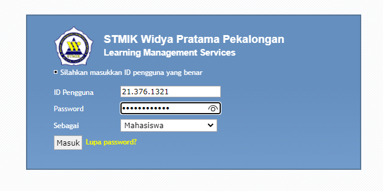
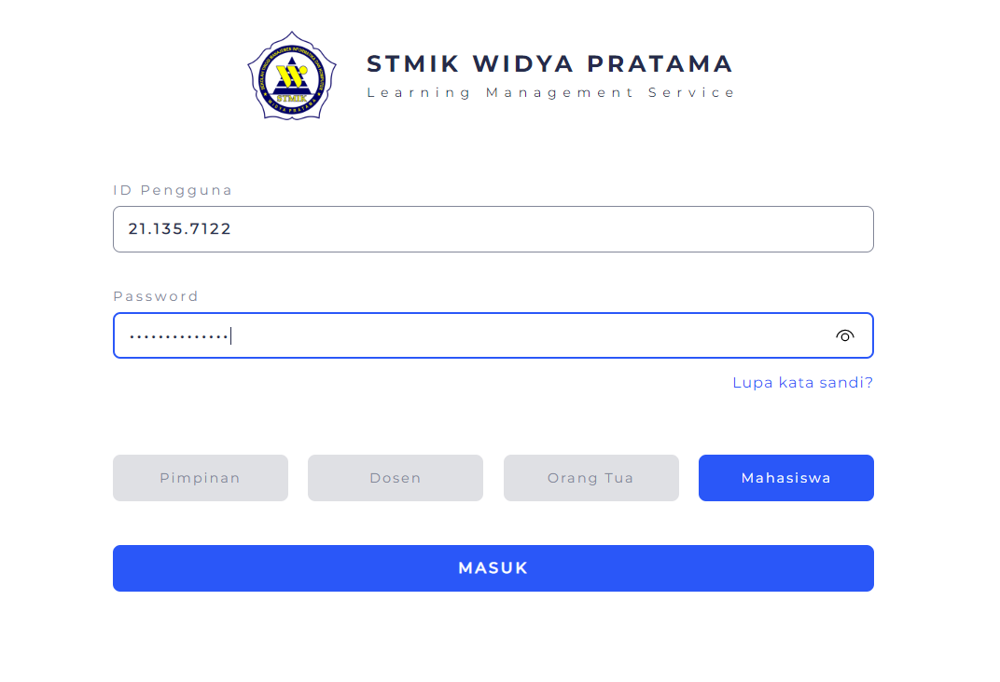

<h4>💁‍♂️ Why i redesign this login page ?</h4>

    &nbsp;The most important goal is the material for me to <b>learn UI and UX Design</b>, in my personal opinion, the LMS login design in my campus still needs a little change. The design that I made does not mean that it is better than the previous design, so <b>I also need suggestions and criticism</b> from friends for the design I made 🙇‍♂️.

<h4>Assets :</h4>
&nbsp;&nbsp;&nbsp; <a href="./app/fonts">• 🖋️ Fonts</a>  
&nbsp;&nbsp;&nbsp; <a href="./app/images">• 📷 Images</a>  
&nbsp;&nbsp;&nbsp; <a href="./public/scss/component/_button_style.scss">• 🖱️ Button Style</a>  
&nbsp;&nbsp;&nbsp; <a href="./public/scss/component/_input_style.scss">• ⌨️  Input Style</a>  

<h4>Before :</h4>

</img>

<h4>After :</h4>

    a. Desktop Version

</img>

    b. Mobile Version

<h4>Feature :</h4>

    a. Popup Alert

    <a href="./public/js/class/Alert.js">« javascript »</a> 
    &nbsp;&nbsp;&nbsp;
    <a href="./public/scss/component/_popup_alert.scss">« scss »</a>

    b. Button
